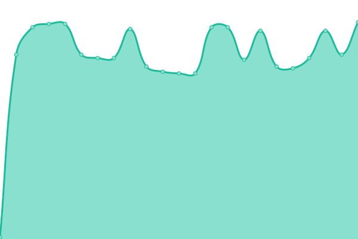

# [📈 Live Status](https://status.titsrp.com): <!--live status--> **🟩 All systems operational**

This repository contains the open-source uptime monitor and status page for [dingus](https://status.titsrp.com), powered by [Upptime](https://github.com/upptime/upptime).

With [Upptime](https://upptime.js.org), you can get your own unlimited and free uptime monitor and status page, powered entirely by a GitHub repository. We use [Issues](https://github.com/cdymlr/server-uptime/issues) as incident reports, [Actions](https://github.com/cdymlr/server-uptime/actions) as uptime monitors, and [Pages](https://status.titsrp.com) for the status page.

<!--start: status pages-->
<!-- This summary is generated by Upptime (https://github.com/upptime/upptime) -->
<!-- Do not edit this manually, your changes will be overwritten -->
<!-- prettier-ignore -->
| URL | Status | History | Response Time | Uptime |
| --- | ------ | ------- | ------------- | ------ |
|  [Forums](https://titsrp.com) | 🟩 Up | [forums.yml](https://github.com/sbsrubik/server-uptime/commits/HEAD/history/forums.yml) | 

 722ms
     
 | 

<a href="https://status.titsrp.com/history/forums">100.00%</a>
    

|  TitsRP Server | 🟩 Up | [tits-rp-server.yml](https://github.com/sbsrubik/server-uptime/commits/HEAD/history/tits-rp-server.yml) | 

 390ms
     
 | 

<a href="https://status.titsrp.com/history/tits-rp-server">100.00%</a>
    

|  Rust Weekly | 🟩 Up | [rust-weekly.yml](https://github.com/sbsrubik/server-uptime/commits/HEAD/history/rust-weekly.yml) | 

 208ms
     
 | 

<a href="https://status.titsrp.com/history/rust-weekly">100.00%</a>
    

|  Rust Bi-Weekly | 🟩 Up | [rust-bi-weekly.yml](https://github.com/sbsrubik/server-uptime/commits/HEAD/history/rust-bi-weekly.yml) | 

 84ms
     
 | 

<a href="https://status.titsrp.com/history/rust-bi-weekly">100.00%</a>
    

|  API Server | 🟩 Up | [api-server.yml](https://github.com/sbsrubik/server-uptime/commits/HEAD/history/api-server.yml) | 

 146ms
     
 | 

<a href="https://status.titsrp.com/history/api-server">100.00%</a>
    

|  Boombox | 🟩 Up | [boombox.yml](https://github.com/sbsrubik/server-uptime/commits/HEAD/history/boombox.yml) | 

 209ms
     
 | 

<a href="https://status.titsrp.com/history/boombox">100.00%</a>
    

<!--end: status pages-->

[**Visit our status website →**](https://status.titsrp.com)

## 📄 License

- Powered by: [Upptime](https://github.com/upptime/upptime)
- Code: [MIT](./LICENSE) © [dingus](https://status.titsrp.com)
- Data in the `./history` directory: [Open Database License](https://opendatacommons.org/licenses/odbl/1-0/)
